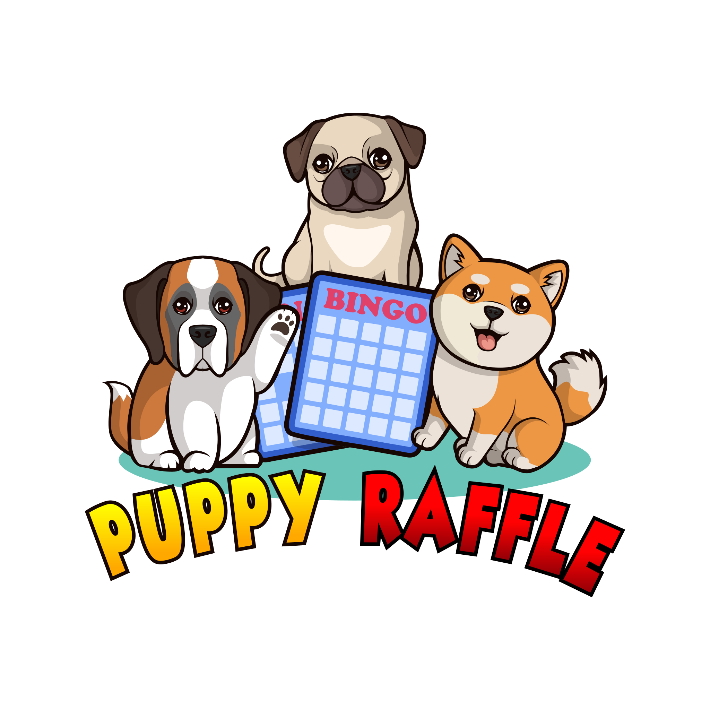

<p align="center">

<br/>

# Puppy Raffle

This project is to enter a raffle to win a cute dog NFT. The protocol should do the following:

1. Call the `enterRaffle` function with the following parameters:
   1. `address[] participants`: A list of addresses that enter. You can use this to enter yourself multiple times, or yourself and a group of your friends.
2. Duplicate addresses are not allowed
3. Users are allowed to get a refund of their ticket & `value` if they call the `refund` function
4. Every X seconds, the raffle will be able to draw a winner and be minted a random puppy
5. The owner of the protocol will set a feeAddress to take a cut of the `value`, and the rest of the funds will be sent to the winner of the puppy.

## Quickstart

```
git clone https://github.com/Cyfrin/4-puppy-raffle-audit
cd 4-puppy-raffle-audit
make
```

# Usage

## Testing

```
forge test
```

### Test Coverage

```
forge coverage
```

and for coverage based testing:

```
forge coverage --report debug
```

# Audit Scope Details

- Commit Hash: e30d199697bbc822b646d76533b66b7d529b8ef5
- In Scope:

```
./src/
└── PuppyRaffle.sol
```

## Compatibilities

- Solc Version: 0.7.6
- Chain(s) to deploy contract to: Ethereum

